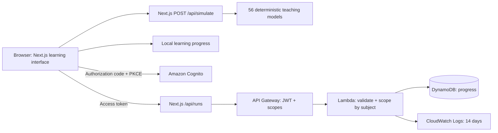

# System Lab

An interactive system design learning application for Aman. Built in a separate directory so the existing browser extension is untouched.

56 guided concepts, seven learning paths, animated SVG request flows, tunable deterministic simulations, a searchable catalog, an AWS service map, and browser-local progress. The optional cloud backend uses real Cognito authentication and Lambda/DynamoDB progress storage. Footer: **Made with heart by [Aman](https://amankeshri.com)**.

## 1. Architecture Overview



**Chosen stack:** Next.js 16 App Router, React 19, strict TypeScript, plain CSS, native SVG, and Lucide icons. The architecture canvas is small enough that a graph framework would add more machinery than value. Native range inputs provide keyboard interaction. A native dialog handles help focus management. The interface respects reduced-motion settings and adapts down to 390px.

**Backend choice:** the application uses short, stateless Lambda work for progress. Lesson recommendations use Lambda for event handlers and bursty APIs, EC2 when long-lived process state or machine control is the teaching objective, and managed services when storage/identity/delivery behavior is the objective. EC2 is a teaching choice, not a requirement for every production implementation of these patterns. Caching clients, for example, can run on either platform.

**Host the web application:** the included standalone Docker image can run on an AWS container host behind HTTPS. It contains the Next.js application and its simulation API. The SAM stack provisions only the authenticated progress backend; it does not provision a frontend host or all services mentioned in lessons. There is no implicit deployment or cloud provisioning when you explore a lesson.

**Managed versus self-hosted:** use managed durable storage, queues, identity, and replication. Operate an EC2 fleet only for lessons where instance lifecycle, application coordination, or a custom ring is the mechanism to learn. ALB health checks are managed; an application circuit breaker is application logic, even when hosted on EC2 and observed through CloudWatch.

**What is implemented:** all 56 concepts have explanations, four-step traces, controls, deterministic calculations, and service mappings. Seven shared visual patterns have concept-specific node labels. These are deliberately simplified teaching models, not distributed-system emulators or AWS load tests. Illustrative metrics are labeled in the UI. The progress backend is executable deployment scaffolding. Live AWS sign-in, provisioning, and DynamoDB writes still require verification in your AWS account before production release.

**Model assumptions:** baseline capacity is 500 requests/s per capacity unit; baseline cache/origin access is 4/110 ms. Traffic is uniform. Cache-aside uses a warm-up and TTL hit-ratio model, not a real Valkey process. Queue depth integrates excess arrivals; retry calculations assume independent failures and at most three attempts. Autoscaling uses five simulated seconds per step; other queue accumulation steps represent one second. Ring movement is the uniform-ring expectation, not a measured distribution. DynamoDB read-capacity examples assume items up to 4 KB. WAF/API Gateway rate limiting is best-effort, not a strict spend cap. DynamoDB global-table eventual-consistency lessons refer to MREC mode; consistency choices depend on the configured global-table mode. No charts contain live AWS telemetry.

## 2. File Tree

```text
system-lab/
├── .dockerignore
├── .env.example
├── .gitignore
├── Dockerfile
├── README.md
├── next-env.d.ts                  # generated by Next.js
├── next.config.ts
├── package.json
├── package-lock.json
├── tsconfig.json
├── public/
├── scripts/
│   ├── prepare-infra.ts           # generate Lambda validation bounds
│   └── start.mjs                  # start standalone server with assets
├── src/
│   ├── app/
│   │   ├── api/
│   │   │   ├── simulate/route.ts  # bounded, validated model execution
│   │   │   └── runs/route.ts      # authenticated cloud progress proxy
│   │   ├── auth/callback/page.tsx # OAuth PKCE callback
│   │   ├── globals.css
│   │   ├── icon.svg
│   │   ├── layout.tsx
│   │   └── page.tsx
│   ├── components/
│   │   ├── architecture.tsx       # SVG flow + inspectable components
│   │   └── lab.tsx                # workspace, catalog, controls, progress
│   └── lib/
│       ├── auth.ts                # Cognito authorization code + PKCE
│       ├── catalog.ts             # 56 lessons, mappings, trade-offs
│       ├── request.ts             # bounded JSON body reader
│       └── simulation.ts          # deterministic scenario calculations
├── infra/
│   ├── concepts.json              # generated, committed deploy input
│   ├── handler.mjs                # user-scoped progress API
│   ├── package.json
│   ├── package-lock.json
│   └── template.yaml              # AWS SAM + Cognito + DynamoDB
└── tests/
    ├── cloud.test.ts              # auth boundary + record validation
    └── simulation.test.ts         # model invariants + API regression checks
```

Generated `.next`, `node_modules`, and TypeScript build caches are omitted.

## 3. Core Implementation

### Validated simulation API

`src/app/api/simulate/route.ts` executes the same model the UI previews. The body reader rejects more than 2 KB even when Content-Length is missing; validation checks the known concept and finite, bounded controls.

```ts
export async function POST(request: Request) {
  try {
    return Response.json(simulate(validateInput(await readJson(request))));
  } catch (error) {
    const message = error instanceof Error ? error.message : "Invalid simulation.";
    return Response.json({ error: message }, {
      status: message === "Request is too large." ? 413 : 400,
    });
  }
}
```

### DynamoDB schema and access patterns

| Attribute | Type | Purpose |
|---|---|---|
| `pk` | String, partition key | `USER#<verified Cognito sub>` |
| `sk` | String, sort key | `CONCEPT#cache-aside` |
| `conceptId` | String | One of the 56 supported lesson IDs |
| `traffic` | Number | Offered requests/s: 50–2,000 |
| `replicas` | Number | Capacity units: integer 1–8 |
| `parameter` | Number | Concept-specific bounded control |
| `completed` | Boolean | True for a completed lesson |
| `updatedAt` | String | Server-generated ISO timestamp |

No GSI is needed. Query one user partition to load progress. Put to the same composite key to upsert completion idempotently. At most 56 bounded items per user makes one query sufficient. The last write wins for configuration, while completion remains true.

```js
const sub = event.requestContext?.authorizer?.jwt?.claims?.sub;
// Handler rejects a missing or malformed subject before any database operation.
await db.send(new PutCommand({
  TableName: process.env.PROGRESS_TABLE,
  Item: {
    pk: `USER#${sub}`,
    sk: `CONCEPT#${conceptId}`,
    conceptId, traffic, replicas, parameter,
    completed: true,
    updatedAt: new Date().toISOString(),
  },
}));
```

The caller cannot supply the user key. API Gateway validates issuer, client audience, signature, expiry, and the required OAuth scope. Cognito invites are administrator-controlled. No AWS access keys are shipped to the browser or needed by the Next.js server; Lambda uses a role restricted to Query/PutItem on its own table.

The OAuth verifier and access token live in sessionStorage, with a 15-minute token lifetime and no refresh token retained. This keeps the personal scaffold small; a broader public deployment should use a reviewed session/auth library with server-side HttpOnly cookies and a nonce-based CSP. The PKCE state expires after ten minutes. Application code never trusts decoded browser claims.

### Interactive visualization

```tsx
<Architecture
  concept={concept}
  running={running}
  point={shownPoint}
  step={step}
  replicas={replicas}
  metric={result.metric}
  unit={result.unit}
/>
```

The SVG paths animate only while a simulation runs. Pause/resume preserves the current step; reset stops playback; changing a control cancels an in-flight start and recomputes the preview. Charts and sparklines derive from the model output. Each component opens an explanation. Search filters by title, description, and AWS service. Completion is enabled after a full run and persists locally; cloud loading explicitly merges remote completion with local completion.

### Local setup and verification

Requirements: Node.js 22+, npm. Dependencies are locked. Google Fonts are optional at runtime; system font fallbacks work without them.

```bash
git clone https://github.com/amankeshri7542/SYS-Design-learning.git
cd SYS-Design-learning
npm ci
npm --prefix infra ci
cp .env.example .env.local
npm run dev
# Open http://localhost:3000

npm test
npm run typecheck
npm run build
npm start
```

The tests execute model bounds for every concept, check cache/throughput/queue/consistency invariants, test malformed and oversized requests, and reject unverified cloud identities. Browser verification covers search, navigation, parameter effects, a full run, saved completion, reload persistence, and mobile overflow. They do not substitute for a real AWS integration test.

### Optional AWS deployment

Install the official [AWS CLI](https://docs.aws.amazon.com/cli/latest/userguide/getting-started-install.html) and [AWS SAM CLI](https://docs.aws.amazon.com/serverless-application-model/latest/developerguide/install-sam-cli.html) and authenticate with a deployment role. The app does not require these CLIs for local learning.

On macOS with Homebrew, one installation option is:

```bash
brew install awscli aws-sam-cli
aws configure sso
aws sso login --profile your-deployment-profile
npm run infra:prepare
cd infra
sam validate --lint
sam build
sam deploy --guided --profile your-deployment-profile
```

Choose your AWS region, a unique `DomainPrefix`, and `AppOrigin` exactly matching the URL used in the browser. Use `http://localhost:3000` for development and HTTPS in production. The template disallows arbitrary HTTP production origins. SAM will ask to create the Lambda execution role. The stack has API throttling, bounded Lambda concurrency, 14-day log retention, encrypted DynamoDB storage, and point-in-time recovery.

Create your invited Cognito user in the AWS console or with `aws cognito-idp admin-create-user --user-pool-id <UserPoolId> --username <your-email> --user-attributes Name=email,Value=<your-email>`. This sends an invitation email when you execute it. No invitation was sent during scaffolding.

Copy stack outputs into `.env.local`, rebuild/restart the web app, open **AWS architecture**, and choose **Connect AWS identity**. Complete a lesson to save it to the cloud; use **Load cloud progress** to merge progress on another device.

```dotenv
# Server only; stack ApiUrl output. No credentials in this value.
AWS_LAB_API_URL=https://<api-id>.execute-api.<region>.amazonaws.com
# Public identifiers. Public values are baked into the Next.js build.
NEXT_PUBLIC_COGNITO_DOMAIN=https://<prefix>.auth.<region>.amazoncognito.com
NEXT_PUBLIC_COGNITO_CLIENT_ID=<ClientId-output>
NEXT_PUBLIC_APP_URL=http://localhost:3000
```

The stack sets `PROGRESS_TABLE` in Lambda automatically and uses its execution role. It does not need `AWS_ACCESS_KEY_ID` or `AWS_SECRET_ACCESS_KEY` application variables. The SAM resources here target the standard AWS commercial partition.

**Real-cloud verification before release:** deploy to a sandbox; verify the sign-in callback; save/load progress; confirm a second user cannot read the first user's partition; confirm expired and incorrectly scoped tokens fail; exercise throttling and storage failure; review logs; and restore a DynamoDB recovery point. No live AWS verification was performed by this scaffold.

**Costs and cleanup:** SAM deployment creates billable resources. API throttling is not a billing ceiling. Add an account budget/alert before use. `sam delete` removes the stack's ordinary resources, but the table and user pool are deliberately retained to avoid losing learning data and identities. Delete retained resources manually only when you intend to discard them. No ElastiCache, Aurora, NAT gateway, EC2 fleet, or other expensive lesson infrastructure is created by this stack.

### Docker

```bash
docker build -t system-lab \
  --build-arg NEXT_PUBLIC_COGNITO_DOMAIN="$NEXT_PUBLIC_COGNITO_DOMAIN" \
  --build-arg NEXT_PUBLIC_COGNITO_CLIENT_ID="$NEXT_PUBLIC_COGNITO_CLIENT_ID" \
  --build-arg NEXT_PUBLIC_APP_URL="$NEXT_PUBLIC_APP_URL" .
docker run --rm -p 3000:3000 \
  -e AWS_LAB_API_URL="$AWS_LAB_API_URL" system-lab
```

The image runs as the unprivileged `node` user. Put a managed HTTPS ingress in front of it for production. For the anonymous simulation endpoint, add ingress rate limits appropriate to a public deployment; the optional cloud API's throttles do not protect the separate frontend host.

## 4. Concept Mapping

`Managed` means the lesson mechanism lives in a managed service; application glue can still be Lambda. Mappings are implementation recommendations, not a claim that every AWS service is deployed in this scaffold.

| # | Concept | AWS services / mechanism | Compute |
|---|---|---|---|
| 1 | Cache-aside | ElastiCache for Valkey | Lambda |
| 2 | Write-through cache | ElastiCache + Aurora | Lambda |
| 3 | Write-behind cache | ElastiCache + SQS | EC2 |
| 4 | Time-to-live | ElastiCache for Valkey | Lambda |
| 5 | Cache eviction | ElastiCache for Valkey | EC2 |
| 6 | Cache invalidation | DynamoDB Streams + Lambda | Lambda |
| 7 | Cache stampede | ElastiCache for Valkey | EC2 |
| 8 | CDN caching | CloudFront + S3 | Managed |
| 9 | Load balancing | Application Load Balancer | EC2 |
| 10 | Horizontal scaling | EC2 Auto Scaling | EC2 |
| 11 | Vertical scaling | EC2 instance families | EC2 |
| 12 | Target-tracking autoscaling | EC2 Auto Scaling + CloudWatch | EC2 |
| 13 | Serverless concurrency | Lambda | Lambda |
| 14 | Rate limiting | API Gateway + AWS WAF | Lambda |
| 15 | Backpressure | SQS + Lambda concurrency | Lambda |
| 16 | Connection pooling | RDS Proxy + Aurora | Lambda |
| 17 | Sharding | DynamoDB partition keys | Managed |
| 18 | Read replicas | Aurora replicas | Managed |
| 19 | Secondary indexes | DynamoDB global secondary indexes | Managed |
| 20 | ACID transactions | Aurora PostgreSQL | Managed |
| 21 | Optimistic locking | DynamoDB conditional writes | Lambda |
| 22 | Denormalization | DynamoDB | Managed |
| 23 | Object storage | S3 | Managed |
| 24 | Data lifecycle | S3 Lifecycle + Glacier | Managed |
| 25 | Message queues | SQS | Lambda |
| 26 | Publish / subscribe | SNS + SQS | Lambda |
| 27 | Event streaming | Kinesis Data Streams | Lambda |
| 28 | Dead-letter queues | SQS dead-letter queue | Lambda |
| 29 | Idempotent consumers | DynamoDB conditional writes + SQS | Lambda |
| 30 | Ordered delivery | SQS FIFO | Lambda |
| 31 | Batch processing | Lambda + SQS | Lambda |
| 32 | Event routing | EventBridge | Lambda |
| 33 | Circuit breakers | EC2 application + CloudWatch | EC2 |
| 34 | Retries with backoff | Step Functions | Lambda |
| 35 | Timeout budgets | API Gateway + Lambda | Lambda |
| 36 | Bulkhead isolation | Lambda reserved concurrency | Lambda |
| 37 | Health checks | Application Load Balancer | EC2 |
| 38 | Multi-AZ failover | Aurora + ALB | Managed |
| 39 | Disaster recovery | AWS Backup + S3 replication | Managed |
| 40 | Metrics, logs & traces | CloudWatch + X-Ray | Lambda |
| 41 | Authentication | Cognito | Managed |
| 42 | Least-privilege authorization | IAM + API Gateway | Lambda |
| 43 | Encryption at rest | KMS + S3 | Managed |
| 44 | Secrets rotation | Secrets Manager | Lambda |
| 45 | Network isolation | VPC + security groups | EC2 |
| 46 | Edge protection | AWS WAF + CloudFront | Managed |
| 47 | Blue / green deployments | CodeDeploy + ALB | EC2 |
| 48 | Canary releases | Lambda aliases + CodeDeploy | Lambda |
| 49 | Eventual consistency | DynamoDB global tables | Managed |
| 50 | Strongly consistent reads | DynamoDB regional tables | Managed |
| 51 | CAP under a partition | DynamoDB global tables / quorum store | EC2 |
| 52 | CQRS | DynamoDB Streams + Lambda | Lambda |
| 53 | Event sourcing | DynamoDB + Streams | Lambda |
| 54 | Distributed sagas | Step Functions | Lambda |
| 55 | Distributed leases | DynamoDB conditional writes | EC2 |
| 56 | Consistent hashing | EC2 application ring | EC2 |

### References

- [Next.js route handlers](https://nextjs.org/docs/app/getting-started/route-handlers)
- [Next.js self-hosting](https://nextjs.org/docs/app/guides/self-hosting)
- [DynamoDB key design](https://docs.aws.amazon.com/amazondynamodb/latest/developerguide/bp-partition-key-design.html)
- [API Gateway HTTP API JWT authorizers](https://docs.aws.amazon.com/apigateway/latest/developerguide/http-api-jwt-authorizer.html)
- [Cognito authorization endpoint and PKCE](https://docs.aws.amazon.com/cognito/latest/developerguide/authorization-endpoint.html)
- [Lambda best practices](https://docs.aws.amazon.com/lambda/latest/dg/best-practices.html)

Made with heart by [Aman](https://amankeshri.com).
