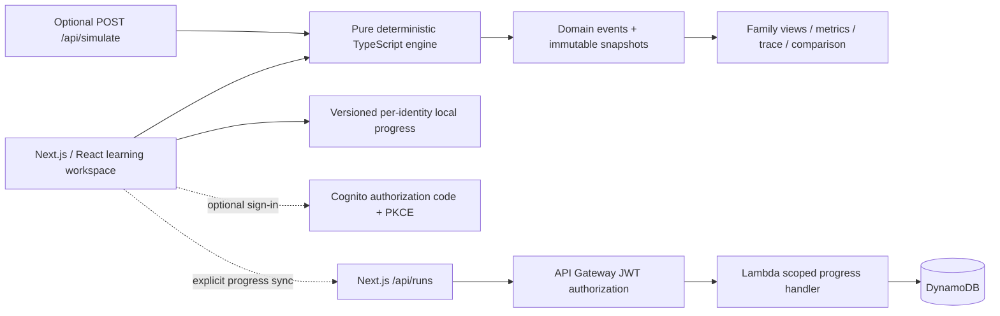

# System Lab

A system-design learning workspace for curious developers. All **56 original lessons** are preserved, with specific controls, inspectable domain state, guided predictions, meaningful pseudocode, and optional AWS explanations.

Made with heart by [Aman](https://amankeshri.com).

## Run locally

Node.js 22+, npm. No AWS credentials are required.

```bash
npm ci
npm --prefix infra ci  # SDK dependencies for the existing cloud boundary tests
npm run dev
# http://localhost:3000

npm run typecheck
npm test
npm run build
npm start

# Reproducible browser checks; starts or reuses localhost:3100
npx playwright install chromium
npm run test:browser
```

The current local preview can use `npm run dev -- --port 3100`. This improvement is local only; no commit, push, deployment, or provisioning is part of it. There is no configured lint script; TypeScript, semantic tests, browser tests, and the production build are the available verification gates.

## Learning experience

- Guided Lesson follows problem → prediction → interaction → observation → explanation → trade-off → implementation. Experiment mode puts state first.
- Cache inventory, instance fleets, message lifecycles, replica versions, atomic records, circuit states, hashing rings, identity/policies, network boundaries, and workflow timelines have distinct renderers.
- Run, pause, resume, reset, single-event step, speed, seek, fault/recovery injection, same-workload baseline comparison, and validated share URLs all use the same deterministic event snapshots.
- Build a system introduces caching, balanced applications/read replicas, queues/workers, safe delivery, and resilience through concrete problems. Follow product reads, orders, and notifications independently.
- Search and category filtering cover all 56 IDs. Optional checks distinguish explored from understood. Legacy completion arrays migrate conservatively. Guest and account records remain separate.
- Mobile layouts stack state, show controls on demand, and use native inspector sheets. Native controls, visible focus, keyboard search, reduced-motion styling, and 16–18px lesson prose support reading and interaction.

See the [per-lesson checklist](docs/lesson-checklist.md), [model contract](docs/model-contract.md), [implementation decisions](docs/implementation-plan.md), and [verification evidence](docs/verification.md). Screenshots are in [docs/screenshots](docs/screenshots).

## Architecture



The stack remains Next.js App Router, React, strict TypeScript, native SVG/HTML controls, plain CSS, and Lucide. Playwright is a development-only addition. There is no mandatory simulation network request. The optional simulation endpoint accepts v2 configuration and returns the same event run as the browser.

Choose Lambda for bounded stateless handlers and progress persistence, EC2 when long-lived application state or instance lifecycle is the teaching objective, and managed services for durable queues, identity, storage, and replication. These are example architectures, not a requirement to operate every listed AWS service. Conceptual view is the default; AWS labels never provision resources.

## Source layout

```text
src/
  app/
    page.tsx, layout.tsx, globals.css, icon.svg
    api/simulate/route.ts      # optional v2 execution; bounded body validation
    api/runs/route.ts          # unchanged authenticated progress contract
    auth/callback/page.tsx
  components/
    lab.tsx                   # navigation, identity-scoped progress, library
    experiment.tsx            # playback, controls, comparison, guided learning
    architecture.tsx          # family renderers and native inspection dialog
    journey.tsx               # connected-system interaction
    cloud-progress.tsx        # explicit sync, errors/retries, local sign-out
  lib/
    catalog.ts                # original 56 IDs, mappings, reviewed metadata
    lessons.ts                # controls, scenarios, content, checks, references
    engine/
      model.ts                # validated config, seeded draws, events, metrics
      traffic.ts              # caches, fleets, message delivery
      data.ts                 # replicas, records, hashing, policy, boundaries
      workflows.ts            # breaker, retries, sagas, leases, reconstruction
      index.ts                # pure model entry point
    journey.ts                # pure connected-operation trace
    progress.ts               # migration, validation, namespace-safe persistence
    auth.ts                   # existing PKCE plus local account/logout helpers
    simulation.ts             # legacy envelope adapter and cloud bounds
    request.ts                # bounded request reader
infra/
  template.yaml, handler.mjs, concepts.json, package.json, package-lock.json
scripts/
  start.mjs, prepare-infra.ts, lesson-checklist.ts
tests/
  engine.test.ts, simulation.test.ts, cloud.test.ts
  browser/workspace.spec.ts
playwright.config.ts
docs/
  implementation-plan.md, lesson-checklist.md, model-contract.md, verification.md
  screenshots/
```

## Core contracts

```ts
const config = makeConfig("cache-aside");
config.values.ttl = 2;
config.seed = 42;
const run = runExperiment(config); // no I/O
const frame = run.frames[eventIndex];
// frame.event, frame.world, and frame.metrics describe the same instant.
```

The queue invariant is `accepted = completed + pending + deadLetter` after every event. Rejections were never accepted. Business effects are separate from delivery acknowledgments. The breaker includes closed → open → half-open → closed/reopened transitions. Hash movement is measured from actual finite key ownership. Canary summaries use the configured candidate share and error probability.

Each model declares its limits. These are educational finite workloads, not AWS quotas, service benchmarks, or capacity forecasts. See [model-contract.md](docs/model-contract.md) for time units and family assumptions.

Progress v2 stores `{ version: 2, explored: string[], understood: string[] }`. The v1 array is retained and migrated to explored only. Unrecognized or unavailable storage never triggers a destructive overwrite. A decoded token subject is used only as a local storage namespace, never as authorization. API Gateway verifies cloud authorization.

The existing DynamoDB schema is retained: `pk=USER#<verified sub>`, `sk=CONCEPT#<lesson>`, `conceptId`, legacy bounded configuration fields, `completed`, and `updatedAt`. It upserts one record per concept. Cloud sync treats these records as explored, using default legacy configuration fields solely for compatibility. It does not claim to synchronize v2 experiment settings or understanding checks.

`POST /api/simulate` still accepts the old input envelope through an adapter, but now returns the v2 event format. Consumers expecting the removed formula `points` response must migrate to `frames`. The application itself uses the engine directly.

Google Fonts are optional runtime resources with system fallbacks. Browsing, simulation, and guest progress require no external service.

### Optional AWS deployment

Install the official [AWS CLI](https://docs.aws.amazon.com/cli/latest/userguide/getting-started-install.html) and [AWS SAM CLI](https://docs.aws.amazon.com/serverless-application-model/latest/developerguide/install-sam-cli.html) and authenticate with a deployment role. The app does not require these CLIs for local learning.

On macOS with Homebrew, one installation option is:

```bash
brew install awscli aws-sam-cli
aws configure sso
aws sso login --profile your-deployment-profile
npm run infra:prepare
cd infra
sam validate --lint
sam build
sam deploy --guided --profile your-deployment-profile
```

Choose your AWS region, a unique `DomainPrefix`, and `AppOrigin` exactly matching the URL used in the browser. Use `http://localhost:3000` for development and HTTPS in production. The template disallows arbitrary HTTP production origins. SAM will ask to create the Lambda execution role. The stack has API throttling, bounded Lambda concurrency, 14-day log retention, encrypted DynamoDB storage, and point-in-time recovery.

Create your invited Cognito user in the AWS console or with `aws cognito-idp admin-create-user --user-pool-id <UserPoolId> --username <your-email> --user-attributes Name=email,Value=<your-email>`. This sends an invitation email when you execute it. No invitation was sent during scaffolding.

Copy stack outputs into `.env.local`, rebuild/restart the web app, open **AWS & account**, and choose **Sign in to invited account**. Use **Sync explored lessons** and **Load account progress** explicitly. Guest records are never silently merged into an account. Understanding checks stay local per account because the existing cloud schema stores explored lessons only.

```dotenv
# Server only; stack ApiUrl output. No credentials in this value.
AWS_LAB_API_URL=https://<api-id>.execute-api.<region>.amazonaws.com
# Public identifiers. Public values are baked into the Next.js build.
NEXT_PUBLIC_COGNITO_DOMAIN=https://<prefix>.auth.<region>.amazoncognito.com
NEXT_PUBLIC_COGNITO_CLIENT_ID=<ClientId-output>
NEXT_PUBLIC_APP_URL=http://localhost:3000
```

The stack sets `PROGRESS_TABLE` in Lambda automatically and uses its execution role. It does not need `AWS_ACCESS_KEY_ID` or `AWS_SECRET_ACCESS_KEY` application variables. The SAM resources here target the standard AWS commercial partition.

**Real-cloud verification before release:** deploy to a sandbox; verify the sign-in callback; save/load progress; confirm a second user cannot read the first user's partition; confirm expired and incorrectly scoped tokens fail; exercise throttling and storage failure; review logs; and restore a DynamoDB recovery point. No live AWS verification was performed by this scaffold.

**Costs and cleanup:** SAM deployment creates billable resources. API throttling is not a billing ceiling. Add an account budget/alert before use. `sam delete` removes the stack's ordinary resources, but the table and user pool are deliberately retained to avoid losing learning data and identities. Delete retained resources manually only when you intend to discard them. No ElastiCache, Aurora, NAT gateway, EC2 fleet, or other expensive lesson infrastructure is created by this stack.

### Docker

```bash
docker build -t system-lab \
  --build-arg NEXT_PUBLIC_COGNITO_DOMAIN="$NEXT_PUBLIC_COGNITO_DOMAIN" \
  --build-arg NEXT_PUBLIC_COGNITO_CLIENT_ID="$NEXT_PUBLIC_COGNITO_CLIENT_ID" \
  --build-arg NEXT_PUBLIC_APP_URL="$NEXT_PUBLIC_APP_URL" .
docker run --rm -p 3000:3000 \
  -e AWS_LAB_API_URL="$AWS_LAB_API_URL" system-lab
```

The image runs as the unprivileged `node` user. Put a managed HTTPS ingress in front of it for production. For the anonymous simulation endpoint, add ingress rate limits appropriate to a public deployment; the optional cloud API's throttles do not protect the separate frontend host.

## 4. Concept Mapping

`Managed` means the lesson mechanism lives in a managed service; application glue can still be Lambda. Mappings are implementation recommendations, not a claim that every AWS service is deployed in this scaffold.

| # | Concept | AWS services / mechanism | Compute |
|---|---|---|---|
| 1 | Cache-aside | ElastiCache for Valkey | Lambda |
| 2 | Write-through cache | ElastiCache + Aurora | Lambda |
| 3 | Write-behind cache | ElastiCache + SQS | EC2 |
| 4 | Time-to-live | ElastiCache for Valkey | Lambda |
| 5 | Cache eviction | ElastiCache for Valkey | EC2 |
| 6 | Cache invalidation | DynamoDB Streams + Lambda | Lambda |
| 7 | Cache stampede | ElastiCache for Valkey | EC2 |
| 8 | CDN caching | CloudFront + S3 | Managed |
| 9 | Load balancing | Application Load Balancer | EC2 |
| 10 | Horizontal scaling | EC2 Auto Scaling | EC2 |
| 11 | Vertical scaling | EC2 instance families | EC2 |
| 12 | Target-tracking autoscaling | EC2 Auto Scaling + CloudWatch | EC2 |
| 13 | Serverless concurrency | Lambda | Lambda |
| 14 | Rate limiting | API Gateway + AWS WAF | Lambda |
| 15 | Backpressure | SQS + Lambda concurrency | Lambda |
| 16 | Connection pooling | RDS Proxy + Aurora | Lambda |
| 17 | Sharding | DynamoDB partition keys | Managed |
| 18 | Read replicas | Aurora replicas | Managed |
| 19 | Secondary indexes | DynamoDB global secondary indexes | Managed |
| 20 | ACID transactions | Aurora PostgreSQL | Managed |
| 21 | Optimistic locking | DynamoDB conditional writes | Lambda |
| 22 | Denormalization | DynamoDB | Managed |
| 23 | Object storage | S3 | Managed |
| 24 | Data lifecycle | S3 Lifecycle + Glacier | Managed |
| 25 | Message queues | SQS | Lambda |
| 26 | Publish / subscribe | SNS + SQS | Lambda |
| 27 | Event streaming | Kinesis Data Streams | Lambda |
| 28 | Dead-letter queues | SQS dead-letter queue | Lambda |
| 29 | Idempotent consumers | DynamoDB conditional writes + SQS | Lambda |
| 30 | Ordered delivery | SQS FIFO | Lambda |
| 31 | Batch processing | Lambda + SQS | Lambda |
| 32 | Event routing | EventBridge | Lambda |
| 33 | Circuit breakers | EC2 application + CloudWatch | EC2 |
| 34 | Retries with backoff | Step Functions | Lambda |
| 35 | Timeout budgets | API Gateway + Lambda | Lambda |
| 36 | Bulkhead isolation | Lambda reserved concurrency | Lambda |
| 37 | Health checks | Application Load Balancer | EC2 |
| 38 | Multi-AZ failover | Aurora + ALB | Managed |
| 39 | Disaster recovery | AWS Backup + S3 replication | Managed |
| 40 | Metrics, logs & traces | CloudWatch + X-Ray | Lambda |
| 41 | Authentication | Cognito | Managed |
| 42 | Least-privilege authorization | IAM + API Gateway | Lambda |
| 43 | Encryption at rest | KMS + S3 | Managed |
| 44 | Secrets rotation | Secrets Manager | Lambda |
| 45 | Network isolation | VPC + security groups | EC2 |
| 46 | Edge protection | AWS WAF + CloudFront | Managed |
| 47 | Blue / green deployments | CodeDeploy + ALB | EC2 |
| 48 | Canary releases | Lambda aliases + CodeDeploy | Lambda |
| 49 | Eventual consistency | DynamoDB global tables | Managed |
| 50 | Strongly consistent reads | DynamoDB regional tables | Managed |
| 51 | CAP under a partition | DynamoDB global tables / quorum store | EC2 |
| 52 | CQRS | DynamoDB Streams + Lambda | Lambda |
| 53 | Event sourcing | DynamoDB + Streams | Lambda |
| 54 | Distributed sagas | Step Functions | Lambda |
| 55 | Distributed leases | DynamoDB conditional writes | EC2 |
| 56 | Consistent hashing | EC2 application ring | EC2 |

### References

- [Next.js route handlers](https://nextjs.org/docs/app/getting-started/route-handlers)
- [Next.js self-hosting](https://nextjs.org/docs/app/guides/self-hosting)
- [DynamoDB key design](https://docs.aws.amazon.com/amazondynamodb/latest/developerguide/bp-partition-key-design.html)
- [API Gateway HTTP API JWT authorizers](https://docs.aws.amazon.com/apigateway/latest/developerguide/http-api-jwt-authorizer.html)
- [Cognito authorization endpoint and PKCE](https://docs.aws.amazon.com/cognito/latest/developerguide/authorization-endpoint.html)
- [Lambda best practices](https://docs.aws.amazon.com/lambda/latest/dg/best-practices.html)

Made with heart by [Aman](https://amankeshri.com).
